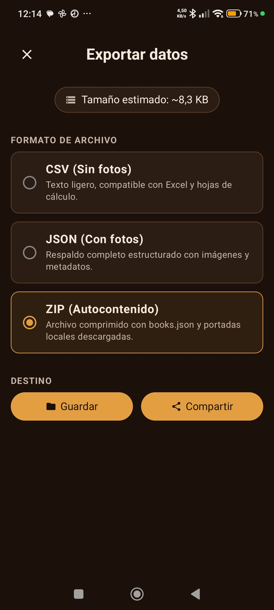
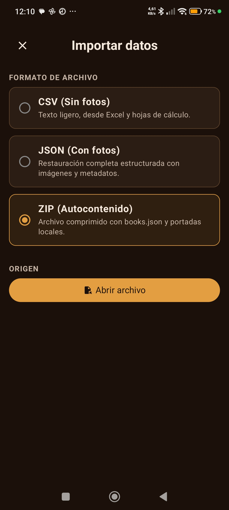

# Flujo de pantallas — ScanBook2

Descripción visual de todas las pantallas de la app y cómo se navega entre ellas.

---

## Mapa de navegación

```
┌─────────────────────────────────────────────────────────────────┐
│                          HOME                                   │
│         (vacío o con lista de libros)                           │
└────┬─────────────────┬───────────────────────┬─────────────────┘
     │ botón Scanbook  │ barra de búsqueda      │ menú ≡
     ▼                 ▼                        ▼
┌──────────┐    ┌─────────────┐    ┌──────────────────────────────┐
│  CÁMARA  │    │ HOME        │    │ MENÚ DESPLEGABLE             │
│ (escaneo │    │ (filtrado)  │    │  · Importar → ImportScreen   │
│  ISBN)   │    └─────────────┘    │  · Exportar → ExportScreen   │
└────┬─────┘                       │  · Tema Color Oscuro (DarkB) │
     │ ISBN leído                  │  · Tema Color Cálido (Warm)  │
     ▼                             └──────────────────────────────┘
┌─────────────────┐
│ RESULTADO DEL   │
│ ESCANEO         │
│ (nuevo o ya     │
│  registrado)    │
└──┬──────────┬───┘
   │ Editar   │ + Añadir
   ▼          ▼
┌───────────────────┐
│  EDITAR LIBRO     │◄── también desde ISBN manual (cámara)
│                   │
│  ┌─ portada ─┐    │
│  │ [ampliar] │───►│ DIALOG ampliar portada
│  │ [eliminar]│───►│ DIALOG confirmar eliminación
│  │ [cámara]  │───►│ FOTO PORTADA (cámara trasera)
│  └───────────┘    │
│  ISBN / Título /  │
│  Autor / Género   │
│                   │
│  [Guardar] ───────┼──► HOME
└───────────────────┘
```

---

## 1. Home — estado vacío

> Pantalla de inicio cuando no hay libros registrados.


**Elementos:**
- Barra superior con icono de menú `≡` y campo de búsqueda
- Empty state: icono de la app + mensaje "No hay libros aún. Escanea tu primer libro."
- Flecha animada apuntando al botón de acción
- Botón FAB **Scanbook** (abajo derecha) — abre la cámara

---

## 2. Home — lista de libros

> Pantalla principal cuando hay libros en la colección.


**Elementos:**
- Cada ítem muestra: miniatura de portada · título · autor · menú `⋮`
- Botón FAB **Scanbook** siempre visible
- La lista es desplazable verticalmente

---

## 3. Home — tema DarkBlue

> La misma lista con el tema oscuro activado (fondo negro puro).


El tema se cambia desde el menú desplegable. Los dos temas disponibles son **WarmEarthy** (marrón cálido, por defecto) y **DarkBlue** (negro frío).

---

## 4. Home — búsqueda activa

> Al escribir en la barra de búsqueda la lista se filtra en tiempo real.


**Comportamiento:**
- Busca por título y por autor simultáneamente
- La X en el campo limpia la búsqueda y restaura la lista completa

---

## 5. Menú de opciones

> Pulsando `≡` se despliega un menú con cuatro opciones.


| Opción | Acción |
|--------|--------|
| **Importar** | Abre `ImportDataScreen` |
| **Exportar** | Abre `ExportDataScreen` |
| **Tema Color Oscuro** | Aplica tema DarkBlue |
| **Tema Color Cálido** | Aplica tema WarmEarthy |

---

## 6. Cámara — escaneo de ISBN

> Pantalla de cámara en tiempo real para detectar el código de barras del libro.


**Elementos:**
- Marco naranja que resalta la zona de escaneo
- Texto de guía: "Alinea el código de barras en el marco para escanear"
- Botón `←` (volver a Home)
- Botón de flash (esquina superior derecha)
- Botón **ISBN manual** — abre `EditBookScreen` vacío para introducir el ISBN a mano

Cuando el código de barras se detecta, la app navega automáticamente a la pantalla de resultado.

---

## 7. Cámara — flash activado

> El flash del dispositivo se puede encender/apagar para escanear en condiciones de poca luz.


---

## 8. Resultado del escaneo — libro nuevo

> Pantalla que muestra los datos recuperados del ISBN escaneado.


**Elementos:**
- Portada descargada automáticamente
- Título, autor, ISBN y género
- Botón **Editar** — abre `EditBookScreen` con los datos pre-rellenos
- Botón **+ Añadir** — guarda el libro directamente y vuelve a Home

---

## 9. Resultado del escaneo — libro ya registrado

> Si el ISBN ya existe en la colección, el botón `+ Añadir` queda deshabilitado.


Aparece el aviso **"¡Este libro ya estaba registrado!"** en la parte inferior. Solo está disponible **Editar** para modificar los datos existentes.

---

## 10. Editar libro — formulario vacío

> Formulario en blanco para introducir un libro manualmente (vía "ISBN manual" desde cámara).


**Campos:**
- Área de portada con botón **Añadir foto / Portada**
- ISBN, Título, Autor, Género
- Botón **Guardar**

Al escribir un ISBN la app realiza una búsqueda automática (debounce 1s) y rellena los campos si encuentra el libro.

---

## 11. Editar libro — datos rellenos

> El mismo formulario con los datos cargados (desde escaneo o búsqueda por ISBN).


La portada aparece en la parte superior. Al pulsar sobre ella se amplía en un dialog (ver §12).

---

## 12. Editar libro — portada ampliada

> Al pulsar la portada en `EditBookScreen` se muestra un dialog de vista ampliada.


- Botón `×` cierra el dialog y vuelve al formulario
- Mantener pulsada la portada ofrece la opción de eliminarla (ver §13)

---

## 13. Editar libro — confirmar eliminación de portada

> Dialog de confirmación antes de borrar la imagen de portada del libro.


- **Cancelar** — cierra el dialog sin cambios
- **Eliminar** (en rojo) — borra el archivo local y limpia `coverLocalPath` en la base de datos

---

## 14. Captura de portada con cámara

> Cuando se pulsa **Añadir foto** en `EditBookScreen` se abre la cámara trasera para fotografiar la portada física.


- Botón **Hacer foto** captura la imagen
- La foto se comprime (100×150 px, JPEG Q60, ~8 KB) y se guarda en `filesDir/covers/{isbn}.jpg`
- La portada queda disponible sin conexión

---

## 15. Exportar datos

> Pantalla para exportar la colección a un archivo.



**Formatos disponibles:**
| Formato | Descripción |
|---------|-------------|
| **CSV** (Sin fotos) | Texto ligero, compatible con Excel y hojas de cálculo |
| **JSON** (Con fotos) | Respaldo completo estructurado con imágenes y metadatos |
| **ZIP** (Autocontenido) ✓ | `books.json` + portadas locales descargadas — seleccionado por defecto |

**Destino:**
- **Guardar** — abre el selector de carpeta del sistema (SAF)
- **Compartir** — abre el share sheet del sistema (correo, Drive, WhatsApp…)

El badge **"Tamaño estimado"** calcula el peso aproximado antes de exportar.

---

## 16. Importar datos

> Pantalla para importar una colección desde un archivo existente.



Mismos tres formatos que en exportación. Al pulsar **Abrir archivo** se abre el selector de archivos del sistema.

- En archivos **ZIP**: las portadas incluidas se restauran automáticamente a `filesDir/covers/` sin necesidad de re-descargarlas.
- Los libros con ISBN ya existente en la base de datos se actualizan.
- Los registros con ISBN vacío se descartan.

---

## Resumen de transiciones

| Desde | Acción | Hacia |
|-------|--------|-------|
| Home | Botón **Scanbook** | Cámara escaneo |
| Home | Campo de búsqueda | Home filtrado |
| Home | Menú ≡ → Importar | ImportDataScreen |
| Home | Menú ≡ → Exportar | ExportDataScreen |
| Home | Menú ≡ → Tema | Home (tema cambiado) |
| Cámara escaneo | ISBN detectado | Resultado escaneo |
| Cámara escaneo | Botón **ISBN manual** | Editar libro (vacío) |
| Cámara escaneo | Botón `←` | Home |
| Resultado escaneo | **+ Añadir** | Home |
| Resultado escaneo | **Editar** | Editar libro (con datos) |
| Resultado escaneo | `←` | Home |
| Editar libro | Pulsar portada | Dialog portada ampliada |
| Editar libro | Long press portada | Dialog eliminar portada |
| Editar libro | **Añadir foto** | Foto portada (cámara) |
| Editar libro | **Guardar** | Home |
| Editar libro | `←` | Pantalla anterior |
| Dialog portada | `×` | Editar libro |
| Dialog eliminar | **Eliminar** | Editar libro (sin portada) |
| Dialog eliminar | **Cancelar** | Editar libro |
| Foto portada | **Hacer foto** | Editar libro (con portada) |
| ImportDataScreen | `×` | Home |
| ImportDataScreen | **Abrir archivo** → éxito | Home |
| ExportDataScreen | `×` | Home |
| ExportDataScreen | **Guardar** / **Compartir** | Home |
